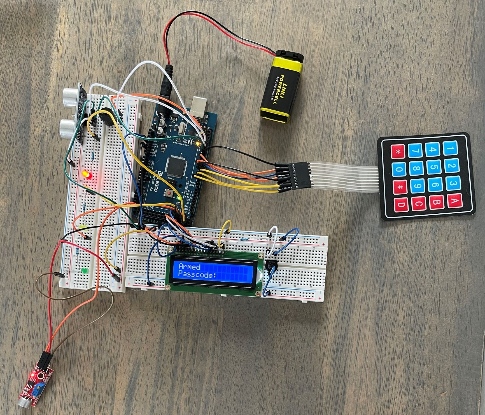

# Alarm-System
Alarm System created with Arduino equipped with sounds sensor and ultrasonic sensor to detect motion. 

Alarms system with a four digit security code.  The alarm system uses an ultrasonic sensor to detect motion when it is armed and uses a sound sensor to detect loud sounds such as the breaking of glass.  The sensitivity of the sound sensor can be adjusted as well as the distance away from the ultrasonic sensor that you need to be to trigger the alarm.

When the alarm is armed there is a 30 second countdown before it is active.  There is also a 30 second buffer to disarm the alarm after it is triggered.  The alarm system uses an LCD display, sound sensor, ultrasonic sensor, LEDs, and a variety of different resistors.

